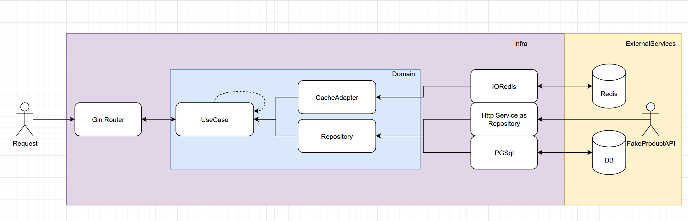

# Customer API 

## Usage

To run this project you will need `docker` and `docker-compose` or ....

- `go 1.24.2`
- `redis 8`
- `postgres 15`
- `go migrate`

### Setting envs

You can set the environment variable by creating a `.env` file.

If you are running with docker-compose just rename the `.env.example` to `.env` and you are good to go

### Starting the project with docker compose

- If you have "Make" you can simply run `make start` and this will start the docker containers if able

- If you don't, Just `set the ENV value as prod` and run `docker compose up --build`

### Starting the project standalone

- Once you have configured your env file you can run `go build -o /bin/customer-api ./cmd/main.go` to build the project
- And then `go run ./bin/customer-api`

### Docs 
 
 Once the project is running you can access `http://localhost:8080/swagger/index.html#/` to get the swagger documentation or you can simply import the swagger definition into your favorite api tool like `postman` or `insomnia`

## Stack

This API uses:
- [gin](https://github.com/gin-gonic/gin)
    - router / framework
- [viper](https://github.com/spf13/viper)
    - env handler
- [postgres](https://www.postgresql.org/)
    - application database
- [redis](https://redis.io/)
    - cache / KV-DB
- [swaggo](https://github.com/swaggo/gin-swagger)
    - auto create swagger routes and comment based documentation
- [uber/mockgen](https://go.uber.org/mock)
    - easily generate mocks to domain interfaces
- [testfy/assert](https://github.com/stretchr/testify)
    - help to improve test assertions

## Architecture

This project tries to apply a clean arch structure and principles (not all were covered)

The **main** command instantiates all services, all repositories and all usecases

The **main** command inject all the needed usecases into the gin handlers

Gin handlers adapts the usecase responses to a **presentation** format as needed

Usecases handle the incoming data, they can depend on other usecases and/or repositories , cache managers

The repositories are interfaces to access data, ***Here I decided to use it for both service and db data***

## Features

- customers
    - authenticate
    - create
    - read
    - update
    - delete
    - wishlist
        - create
        - update
            - change title
            - add product
            - remove product
        - delete
- products
    - read
    - list

## Scalability and Reliability

For the product related routes I've chosen to make the external service the source of truth with a cache layer around it, so once the service responds with success I simply add the response to a cache and then parse it to store into the database. Once the cache is warm the service will not receive as much requests as incoming, and if both cache and service fails the database tries to solve.

For slice iterations (A.K.A arrays) I've used go routines to run every single item in a parallel routine this can improve the performance and scalability of the system by using multithreading.

## Things that I wish I've done

- Pagination
    - pagination is expected but it's not working because the chosen api does not support pagination
    
- More tests:
    - Currently only the usecase layer has some tests due to `TDD`, but I wish I could make other unit tests
    - Add integration tests
    - Add some crucial end-to-end tests
- Usecases:
    - Split usecases into smaller parts like Validators or smaller usecases
    - Use a generic interface for every single usecase so that I can use some Decorators
- Domain
    - create more domain errors to let every single error easier to track and handle
    - think more about Interface Segregation or not
        - Currently I've split the interfaces so they can have a single responsibility but this causes too much injection on main file
    - Fix timestamps
        - For some reason go is breaking the date when it comes from the database to the domain layer
- Observability
    - the current project has no logs, no traces, no metrics. I wish i could add some open telemetry or decorator based logs
- Database
    - currently I've made possible to create more than one wishlist but I wish I've created more fancy solutions on the database, instead to use an array of product ids I could make other table and also store things like "the price when you saved"
- Abstraction
    - product related usecases could have a WithFallback decorator, were first it tries to get the data from the service and after that it tries to get the data from the database to store on database or vice-versa
    - cache could work with an decorator in some usecases